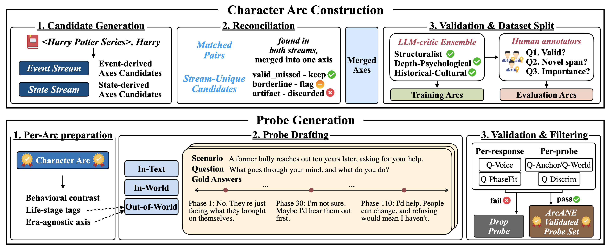

# ArcANE: Do Role-Playing Language Agents Stay in Character at the Right Time?

  
  
  
  
  
  
  

**🏆 Accepted to EMNLP 2026 Main Conference**

🌐 **Project page and results explorer:** [holi-lab.github.io/ArcANE](https://holi-lab.github.io/ArcANE/) — browse every novel, character, arc, and probe, with the phase-keyed references, judge scores, and model responses.

**ArcANE** evaluates and trains role-playing language agents as **dynamic characters**. It builds a character arc per psychological axis, generates phase-keyed probes, and scores whether an agent's response matches the character's state at the queried narrative point.

  

## Published Models and Training Data

The [ArcANE collection](https://huggingface.co/collections/holi-lab/arcane) contains the training dataset and all five checkpoints, accessible without authentication:

| Stage | 8B checkpoint | 32B checkpoint |
| --- | --- | --- |
| SFT | [ArcANE-8B-SFT](https://huggingface.co/holi-lab/ArcANE-8B-SFT) | [ArcANE-32B-SFT](https://huggingface.co/holi-lab/ArcANE-32B-SFT) |
| DPO | [ArcANE-8B-DPO](https://huggingface.co/holi-lab/ArcANE-8B-DPO) | [ArcANE-32B-DPO](https://huggingface.co/holi-lab/ArcANE-32B-DPO) |
| RLVR | Not trained | [ArcANE-32B-RLVR](https://huggingface.co/holi-lab/ArcANE-32B-RLVR) |

All five repositories contain full Transformers checkpoints. The 32B models were trained with LoRA, but the published weights are already merged: load their model IDs directly, without `--enable-lora` or an adapter merge.

[ArcANE-Data](https://huggingface.co/datasets/holi-lab/ArcANE-Data) provides `sft`, `dpo`, and `rl` configurations. This public training subset covers ten novels and excludes *East Lynne* and *The Underdogs*. It contains 20,560/2,285 SFT, 12,746/375 DPO, and 2,513/678 RL train/test examples. It is distinct from the benchmark arcs, probes, and judge outputs bundled in this repository, and from the historical training pool described in the paper and model cards. See [training data usage](training/README.md#dataset-configurations).

[hf_release_manifest.json](hf_release_manifest.json) records the immutable dataset and model revisions checked on September 5, 2026, together with the downloaded parquet files' verified sizes and SHA-256 hashes. The training recipes pin these published inputs. To recheck anonymous access, split declarations, LFS metadata, and indexed checkpoint files without downloading model weights:

~~~bash
uv run python -m analysis.check_hf_release
~~~

## Pipeline

| Stage | Module | Produces |
| --- | --- | --- |
| 1. Arc Construction | [`arc_construction/`](arc_construction/) | One arc per (character, psychological axis), split into phases |
| 2. Probe Generation | [`probe_generation/`](probe_generation/) | Phase-keyed (scenario, question) probes with reference responses |
| 3. Inference | [`inference/`](inference/) | Agent responses under six context modes, using OpenAI-compatible chat backends |
| 4. Evaluation | [`evaluation/`](evaluation/) | Per-response **APF / RPF / RAE** and trajectory **PTF** judge scores |
| 5. Training | [`training/`](training/) | `ArcANE-{8B,32B}` via SFT → DPO, then RLVR on 32B |
| 6. Analysis | [`analysis/`](analysis/) | Paper tables — see [Reproducing the Paper](#reproducing-the-paper) |

## Setup

~~~bash
uv sync                          # add --extra serving for local vLLM

export OPENAI_API_KEY=sk-...     # arc construction, probes, embeddings
export OPENROUTER_API_KEY=sk-... # DeepSeek baselines + default judge
~~~

Environment-variable overrides are documented in [`inference/config.py`](inference/config.py), [`evaluation/per_response/config.py`](evaluation/per_response/config.py) and [`probe_generation/config.py`](probe_generation/config.py). The probe-generation, inference, evaluation, and main-table CLIs accept `--help`.

## Reproducing the Paper

`results/inference/` ships the judge outputs the paper tables aggregate, so the tables rebuild **without any API calls**.

~~~bash
uv run python -m analysis.build_paper_table --ours-arcane   # --ours-arcane wraps the model name in \ours{}
uv run python -m analysis.build_per_character_analysis      # Arc lift, central vs supporting characters
~~~

These commands aggregate the four public evaluation novels. Use `--strict` with `analysis.build_paper_table` to require all requested inputs.

`--novels` presets: `main` (validated slice), `lowpop` (held-out low-popularity slice — *He Knew He Was Right*, *The Odd Women*), `extra3` (training-novel reference table — *The Underdogs*, *East Lynne*; both are in the training pool, so ArcANE results on them are in-distribution). `--models added` builds the added-baselines table. Outputs land in `paper_results/`.

~~~bash
uv run python -m analysis.build_paper_table --ours-arcane --novels lowpop \
    --out paper_results/main_table_lowpop.tex --label tab:main_results_lowpop
~~~

## 1. Arc Construction

Download the selected Project Gutenberg edition into `data/novels/`. The downloader uses the filename expected by every pipeline stage and leaves existing files unchanged. [`data/novels/README.md`](data/novels/README.md) lists all source editions and slugs.

~~~bash
uv run python -m arc_construction.download_novels --novel Anna_Kareina

NOVEL_NAME=Anna_Kareina uv run python -m arc_construction.run_all
~~~

Use `uv run python -m arc_construction.download_novels --all` to download all eighteen public-domain titles, or `--list` to list them. Downloaded texts and generated chapter files stay local and are excluded from version control and release packages.

Phases 0–3 write to `results/arc_extraction/{novel}/` using `ARC_MODEL` (default `gpt-5.4-mini`). Phase 4 (`phase4_validate_axes.py`) aggregates human annotations and is run separately.

Prepare chapter files for source grounding and chapter-based context without API calls:

~~~bash
NOVEL_NAME=Anna_Kareina uv run python -m arc_construction.phase0_preprocess
~~~

## 2. Probe Generation

~~~bash
uv run python -m probe_generation --novel Anna_Kareina --all-characters
~~~

Writes `results/arc_extraction/{novel}/probes/{character}_probes.json`. Probe types are In-Scenario (`in_text`), In-World (`in_world`) and Out-of-World (`out_of_world`). Use these IDs with `--probe-types`.

## 3. Inference

Six modes: `vanilla`, `arc`, `summary`, `rag`, `timechara`, `lifechoice`. `vanilla` and `arc` run straight away; `summary`, `timechara` and `lifechoice` need `chapters/` (Stage 1), and `rag` and `lifechoice` need the RAG index.

Add `--dry-run --limit 1` to an inference command to print JSONL previews without API calls or changes to result files or inference caches. Local prompts are rendered when their inputs are available. For `rag`, `lifechoice`, and `timechara`, API-dependent context is deferred (`prompt_complete: false`). Missing prerequisites appear in `precheck_error` or inline prompt warnings. Preview rows are marked `dry_run: true`.

~~~bash
uv run python -m inference.build_summaries --novel Anna_Kareina
uv run python -m inference.build_index     --novel Anna_Kareina

export EXP_CHAT_BASE_URL=https://openrouter.ai/api/v1
export EXP_CHAT_API_KEY=$OPENROUTER_API_KEY
export EXP_OPENROUTER_PROVIDER=deepseek

uv run python -m inference \
    --novel Anna_Kareina --character anna_karenina \
    --mode vanilla,arc,summary,rag,timechara,lifechoice \
    --model deepseek/deepseek-v4-flash
~~~

`EXP_CHAT_BASE_URL` / `EXP_CHAT_API_KEY` select the backend — OpenAI, OpenRouter, or a local vLLM server (`http://localhost:8000/v1`, key `EMPTY`):

~~~bash
# Published ArcANE checkpoint (already merged)
uv run --extra serving vllm serve holi-lab/ArcANE-32B-DPO --port 8001 \
    --revision 9b1dc3d21e44692cf1b5edd0ab55af499696c059 \
    --served-model-name arcane-32B-dpo
~~~

In a second terminal, select that server and generate benchmark responses:

~~~bash
EXP_CHAT_BASE_URL=http://127.0.0.1:8001/v1 EXP_CHAT_API_KEY=EMPTY \
uv run python -m inference \
    --novel Anna_Kareina --character anna_karenina \
    --mode vanilla,arc --model arcane-32B-dpo
~~~

Use the matching model ID and revision from the manifest for another released checkpoint. The paper-table scripts recognize `arcane-8B-dpo`, `arcane-32B-dpo`, `arcane-8B-sft`, and `arcane-32B-sft`; preserve these served names, including the capital `B`, when generating their input records. The RLVR checkpoint can be served as `arcane-32B-rlvr` and evaluated with Stage 4, but is not a model row in the bundled table presets.

Non-thinking mode is enabled automatically for served names containing `qwen3` or `arcane`; override with `EXP_DISABLE_THINKING=1` or `0`.

## 4. Evaluation

Run Stage 3 first to create `{mode}__{model}.jsonl` response files. The commands below score those generated responses; the Hugging Face training parquet files are not inputs to these judges.

~~~bash
uv run python -m evaluation.per_response --novel Anna_Kareina --character anna_karenina
uv run python -m evaluation.trajectory   --novel Anna_Kareina --character anna_karenina
~~~

Both judges default to `deepseek/deepseek-v4-flash` over OpenRouter with the provider pinned; switch via `EXP_JUDGE_MODEL` / `EXP_JUDGE_BACKEND`. There is no resume: each run re-scores all selected responses. Successful runs replace `eval_records_{tag}.jsonl` / `traj_records_{tag}.jsonl` and their summaries in `results/inference/{novel}/{character}/`. Failed judge attempts preserve existing outputs and save attempt records in separate `.partial` files.

## 5. Training

The **SFT → DPO → RLVR** stack lives in [`training/`](training/), environment-isolated from the pipeline above; [`training/README.md`](training/README.md) has the Appendix D hyperparameters and the dataset configurations. Training data: [ArcANE-Data](https://huggingface.co/datasets/holi-lab/ArcANE-Data).

~~~bash
cd training/sft && uv sync
uv pip install flash-attn --no-build-isolation   # configs request flash_attention_2

bash scripts/train_sft_lora.sh    # 32B / LoRA  (8B full-tuning: train_sft_full.sh)
bash scripts/train_dpo_lora.sh    # 32B / LoRA  (8B full-tuning: train_dpo_full.sh)
~~~

Without a CUDA toolchain for flash-attn, append `--attn-implementation sdpa` to either script.

The DPO configs start from pinned revisions of the published `holi-lab/ArcANE-{8B,32B}-SFT` checkpoints. To chain your own SFT run into DPO, follow the full-model or local-LoRA instructions in [training/sft/README.md](training/sft/README.md). Retraining on the public ten-novel subset uses different data from the original checkpoints.

RLVR is applied to **ArcANE-32B only**, on a pinned [verl](https://github.com/verl-project/verl) checkout in its own conda environment. From the repository root:

~~~bash
cd training/rl

git clone https://github.com/verl-project/verl.git third_party/verl
git -C third_party/verl checkout 081df509ca9fe02d524f913a7a3f96eefe9ca568
bash scripts/install_env.sh && conda activate ./.conda/verl   # prefix env, activate by path

ARCANE_REWARD_MODE=remote \
ARCANE_REWARD_URL=http://127.0.0.1:8000/score bash scripts/run_grpo.sh
~~~

The launcher uses the published ArcANE-32B-DPO checkpoint and requires a reward-service URL. See [the RLVR setup](training/rl/README.md) for the reward interface and local-adapter options.

## Project Page

[`project_page/`](project_page/) holds the static site deployed to [holi-lab.github.io/ArcANE](https://holi-lab.github.io/ArcANE/) by [`.github/workflows/deploy-pages.yml`](.github/workflows/deploy-pages.yml). Its data bundle (`project_page/data/`) is generated from the released arcs, probes, and judge outputs; model responses shown in the explorer come from the raw inference files, which are not tracked in this repository.

~~~bash
python project_page/build/build_data.py                       # scores, arcs, probes only
python project_page/build/build_data.py --responses-root DIR  # DIR holds {novel}/{character}/{mode}__{model}.jsonl
~~~

## Citation

~~~bibtex
@misc{song2026arcaneroleplayinglanguageagents,
      title={ArcANE: Do Role-Playing Language Agents Stay in Character at the Right Time?},
      author={Woojung Song and Nalim Kim and Sangjun Song and Chaewon Heo and Jongwon Lim and Yohan Jo},
      year={2026},
      eprint={2606.05553},
      archivePrefix={arXiv},
      primaryClass={cs.CL},
      url={https://arxiv.org/abs/2606.05553},
}
~~~

## License

Code is licensed under the [MIT License](LICENSE), and ArcANE annotations (arcs, probes, validator verdicts, and judge outputs) under [CC BY 4.0](LICENSE-DATA). Quoted source passages are excluded from the data license; source editions are identified in [`data/novels/README.md`](data/novels/README.md).
